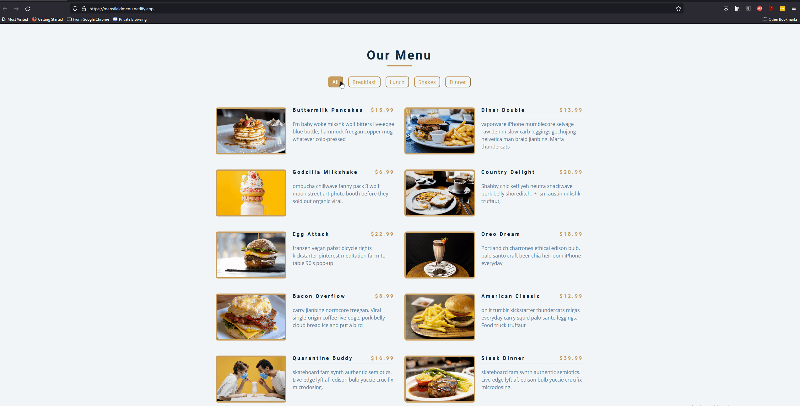

# Mansfield Menu
An online menu where users can browse the most popular meals based on when they would like to eat. 

See the project here: https://mansfieldmenu.netlify.app/

## How It's Made:
**Tech used:** HTML, CSS, JavaScript
 

## Optimizations

The main focus on this excersise was to not only refresh and solidfy my foundational understandings of HTML, CSS, and JS. While also using each tool to create a stylized way to organize elements

## Lessons Learned:

Adding and removing classes from the DOM with clicks allows user to display only important information. 
